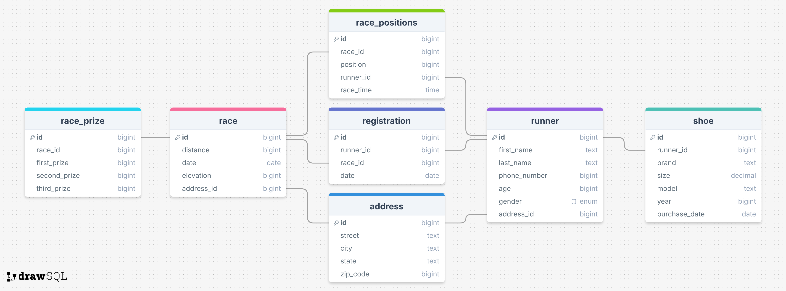

# Road Race

My project models data that is useful for someone creating road race events. It includes information about the races (registration, event time, prizes, results, etc.) and the runners (name, age, shoes, etc.). Code and examples can be found here.





## Query I thought it did well on

**Question**: Who signed up for a race but never ran it?

**GPT SQL Response**:
```sql
SELECT r.first_name, r.last_name
FROM runner r
JOIN registration reg ON r.id = reg.runner_id
LEFT JOIN race_positions rp ON reg.race_id = rp.race_id AND r.id = rp.runner_id
WHERE rp.id IS NULL;
```

**Friendly Response**: John Doe signed up for the race but never ran it.


## Question that it tripped up on

**Question**: How long before a race do most people register?

**GPT SQL Response**:
```sql
SELECT date - registration.date AS days_before
FROM registration
JOIN race ON registration.race_id = race.id
GROUP BY days_before
ORDER BY COUNT(*) DESC
LIMIT 1;
```

SQL Error: "ambiguous column name: date"

**Friendly response**: I'm sorry, I need more specific information to provide an accurate answer, such as the context or specific event.

Although my prompt was purposefully a little vague, I was hoping it would return an amount of time at least. Instead, it didn't even generate correct SQL syntax. After running the same question a few times, it was able to answer with correct data. 

## Single Domain Double Shot Vs Zero Shot
I didn't notice much of a difference between the double shot and the zero shot. The only differences I found were slightly more specific responses depending on how I worded the prompts. If I included more detail in my examples, it generally followed suit.

## Conclusion
It seems that this would be very useful for simple and very specific queries. An engineer without SQL training would be able to ask questions about a database and get accurate responses for the most part. This engineer would have to be trained on how to phrase the prompts so that there is no ambiguity in what information they need. It would probably have to be checked by someone who knows SQL to verify accuracy.
